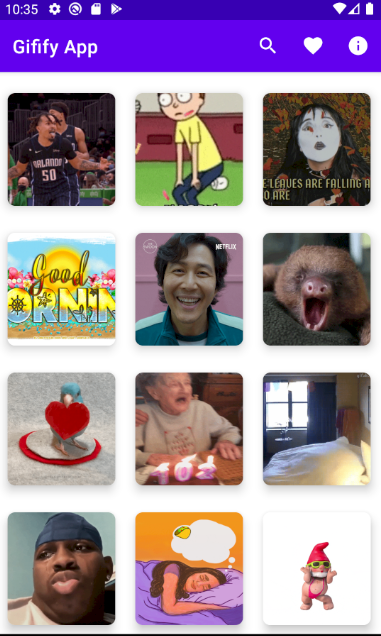

# GififyApp
Application with a clean architecture this built with
 - MVVM
 - Dagger - Hilt
 - Extension Functions
 - Retrofit
 - Navigation Components
 - ViewBinding
 - Coroutines 
 - Room Database

 # Support
 You need create a API key from https://developers.giphy.com/
 
 # Get it on Google PlayStore
 
 
 
 # Architecture
 
 

 
 # Screen

